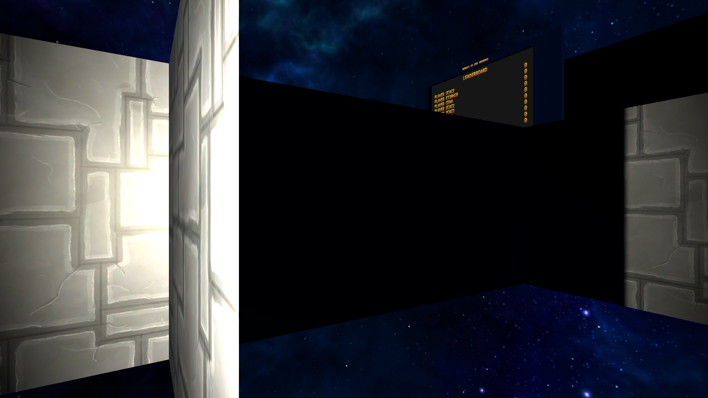
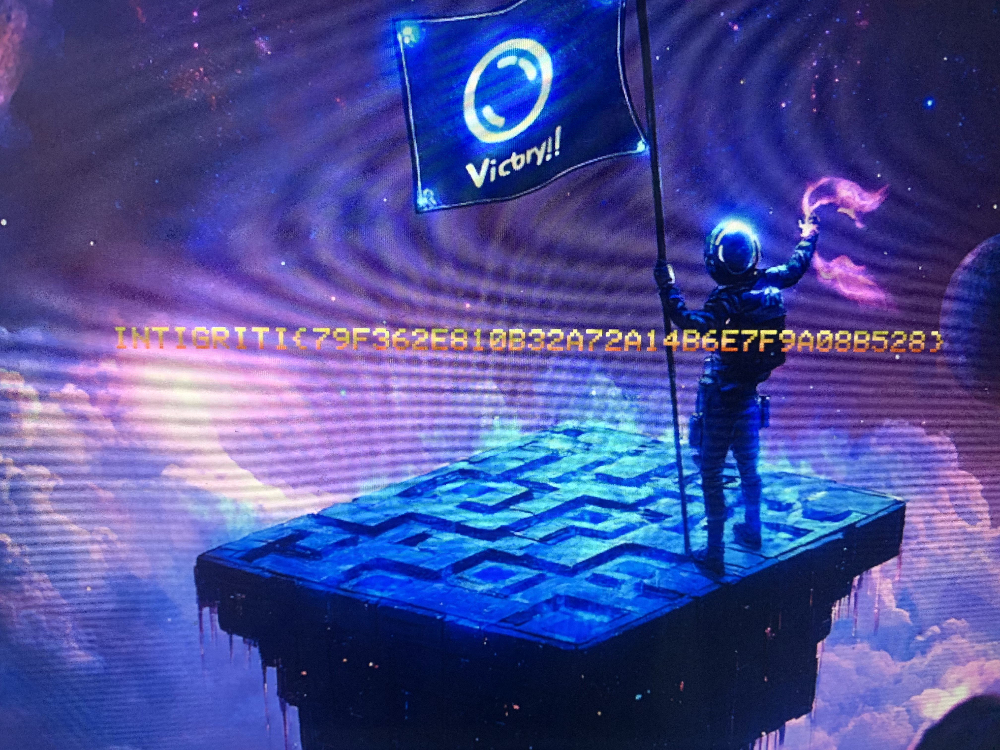

# CTF Writeup - Space Maze (1337up Live 2024)

---

## Overview

**CTF Name:** 1337up Live 2024  
**Date:** Fri, 15 Nov. 2024, 18:59 ICT — Sun, 17 Nov. 2024, 06:59 ICT  
**Challenge Name:** Space Maze  
**Challenge Points:** 500  
**Solvers:** 3  

**Description:**  
Lost in a maze among the stars, you must find the exit before time runs out. Think fast, move faster, and discover what secrets the maze holds. Good luck!

---

## Preface

This is my very first writeup! I hope this serves as a decent guide, and I’d love feedback on how to improve it. Note: Since the CTF servers closed after the event, I couldn't include many images. So, please use your imagination!

---

## Given Files

- A ZIP file containing a Unity game for Windows.

---

## Solution

### 1. Take a Look 👀

After extracting the files, I quickly recognized this as a Unity game. Using [Il2CppDumper](https://github.com/Perfare/Il2CppDumper/releases/tag/v6.7.46), I checked the header file `Fun With Spikes_Data/il2cpp_data/Metadata/global-metadata.dat`.  

- I noticed the hex sequence `AF 1B B1 FA 1F 00 00 00`.  
- `1F 00 00 00` indicates version 31.  
So, I used **Il2CppDumper version 6.7.46**, which supports Unity version 31.

Files used for dumping:
- `global-metadata.dat`  
- `GameAssembly.dll`

Meanwhile, I played the game. It’s a maze where you collect scattered portals to gain points. Each time you touch a portal, you’re teleported back to the spawn point. The maze expands after each wave, and you get 5 minutes per wave. Naturally, I thought, *why not hack this to teleport myself?*

---

### 2. Look Closer 🔍

To make a teleport hack, I needed two things:
1. Player coordinates.  
2. Portal coordinates.  

I loaded the dumped DLLs into dnSpy to investigate further.

---

#### 2.1 Teleportation Magic

Finding player coordinates was straightforward. In the **Player** class, which inherits from **NetworkBehaviour**, I found an `Update()` method. This led me to:
- `Component$$getTransform`  
- `Transform$$setPosition`  

**Pro Tip:** The **Player** class has a field:
```csharp
private bool <IsLocalPlayer>k__BackingField; // 0x1C
```
This is super useful to distinguish my player from others because Unity tends to update all players in the same function. And no, I don’t want to mess with other players—too chaotic. 😂  

Using Frida, I hooked into the relevant functions and wrote the following script to teleport myself randomly.

```javascript
function waitForModule(moduleName, callback) {
    var interval = setInterval(function () {
        var baseAddr = Module.findBaseAddress(moduleName);
        if (baseAddr) {
            clearInterval(interval);
            console.log(moduleName + ' loaded at: ' + baseAddr);
            callback(baseAddr);
        }
    }, 100);
}

waitForModule('GameAssembly.dll', function (baseAddr) {
    var Player$$update = baseAddr.add(0xDF8780);
    var Component$$getTransform = baseAddr.add(0x69CE60);
    var Transform$$setPosition = baseAddr.add(0x7E63F0);

    Interceptor.attach(Player$$update, {
        onEnter: function (args) {
            this.playerInstance = args[0];
        },
        onLeave: function (retval) {
            var setPosition = new NativeFunction(Transform$$setPosition, 'void', ['pointer', 'pointer']);
            var vectorMemory = Memory.alloc(12);
            vectorMemory.writeFloat(-11);
            vectorMemory.add(4).writeFloat(-3);
            vectorMemory.add(8).writeFloat(4);
            setPosition(this.playerInstance, vectorMemory);
        }
    });
});
```

**Result:**  
I teleported... right into a wall. Well, at least teleportation works. Baby steps. 😅  
  

---

#### 2.2 Finding the Portal Coordinates

Searching for “portal,” I found a field in the **MazeGenerator** class:
```csharp
[FieldOffset(Offset = "0x28")]
public GameObject portal;
```

However, the coordinates stayed constant (`0, 1, 0`) no matter how many portals spawned. So, I moved on.  

Eventually, I found a method:
```csharp
[Address(RVA = "0xDF1070", Offset = "0xDEF670", VA = "0x180DF1070")]
private void FacePlayer(GameObject portalObj)
```
Hooking this function and printing the coordinates gave me promising results:
```javascript
var MazeGenerator$$facePlayer = baseAddr.add(0xDF1070);
var GameObject$$getTransform = baseAddr.add(0x69E610);
var Transform$$getPosition = baseAddr.add(0x7E5C70);

Interceptor.attach(MazeGenerator$$facePlayer, {
    onEnter: function (args) {
        this.portalInstance = args[1];
    },
    onLeave: function (retval) {
        var getTransform = new NativeFunction(GameObject$$getTransform, 'pointer', ['pointer']);
        var portalTransform = getTransform(this.portalInstance);

        if (portalTransform.isNull() || this.portalInstance.isNull()) {
            console.log('Invalid transform for portal instance.');
            return;
        }

        var getPosition = new NativeFunction(Transform$$getPosition, 'pointer', ['pointer', 'pointer']);
        var vectorMemory = Memory.alloc(12);
        getPosition(vectorMemory, portalTransform);
        console.log('Portal position: ' + vectorMemory.readFloat() + ', ' + vectorMemory.add(4).readFloat() + ', ' + vectorMemory.add(8).readFloat());
    }
});
```

Gotcha! This gave me the portal coordinates.

---

#### 2.3 Putting It All Together

Combining everything, I noticed old portal coordinates persisted even after touching them. To avoid overlapping portals, I used two lists: `portalList` and `usedPortalList` (Don’t ask why I used two arrays instead of a queue... it just works). I added a 5-second delay between teleports and offset the Y-coordinate slightly to “touch grass” (portals are higher than the player).

```javascript
function waitForModule(moduleName: any, callback: any) {
    var interval = setInterval(function () {
        var baseAddr = Module.findBaseAddress(moduleName);
        if (baseAddr) {
            clearInterval(interval);
            console.log(moduleName + ' loaded at: ' + baseAddr);
            callback(baseAddr);
        }
    }, 100);
}

waitForModule('GameAssembly.dll', function (baseAddr: any) {
    var Player$$update = baseAddr.add(0xDF8780);
    var MazeGenerator$$facePlayer = baseAddr.add(0xDF1070);
    var Component$$getTransform = baseAddr.add(0x69CE60);
    var GameObject$$getTransform = baseAddr.add(0x69E610);
    var Transform$$getPosition = baseAddr.add(0x7E5C70);
    var Transform$$setPosition = baseAddr.add(0x7E63F0);

    var portalList: any = [];
    var usedPortalList: any = [];

    var lastUpdateTime = (new Date()).getTime();
    var selectedPortal: any = null;

    console.log('Hooking Update at: ' + Player$$update);

    Interceptor.attach(Player$$update, {
        onEnter: function (args) {
            this.playerInstance = args[0];
        },
        onLeave: function (retval) {
            try {
                if (this.playerInstance.isNull()) {
                    console.log('Invalid player instance pointer.');
                    return;
                }

                var Player$$isLocalPlayerOffset = 0x1C;
                var isLocalPlayer = this.playerInstance.add(Player$$isLocalPlayerOffset).readU8();
                var currentTime = (new Date()).getTime();
                if (isLocalPlayer !== 0 && currentTime - lastUpdateTime > 5000) {
                    lastUpdateTime = currentTime;

                    var getTransform = new NativeFunction(Component$$getTransform, 'pointer', ['pointer']);
                    var playerTransform = getTransform(this.playerInstance);

                    if (playerTransform.isNull()) {
                        console.log('Invalid player transform pointer.');
                        return;
                    }
                    for (var i = 0; i < portalList.length; i++) {
                        if (usedPortalList.some((portal: any) => portal.position.x === portalList[i].position.x && portal.position.y === portalList[i].position.y && portal.position.z === portalList[i].position.z)) {
                            continue;
                        }
                        selectedPortal = portalList[i];
                        break;
                    }

                    if (!selectedPortal) {
                        console.log('No available portal.');
                        return;
                    }

                    console.log('Setting player position to portal:', selectedPortal.position.x, selectedPortal.position.y, selectedPortal.position.z);
                    var setPosition = new NativeFunction(Transform$$setPosition, 'void', ['pointer', 'pointer']);
                    var vectorMemory = Memory.alloc(12);
                    vectorMemory.writeFloat(selectedPortal.position.x);
                    vectorMemory.add(4).writeFloat(selectedPortal.position.y - 1);
                    vectorMemory.add(8).writeFloat(selectedPortal.position.z);
                    setPosition(playerTransform, vectorMemory);
                    usedPortalList.push(selectedPortal);
                }
            } catch (err: any) {
                console.error('Error:', err.message);
            }
        }
    });

    Interceptor.attach(MazeGenerator$$facePlayer, {
        onEnter: function (args) {
            this.portalInstance = args[1];
        },
        onLeave: function (retval) {
            var getTransform = new NativeFunction(GameObject$$getTransform, 'pointer', ['pointer']);
            var portalTransform = getTransform(this.portalInstance);

            if (portalTransform.isNull() || this.portalInstance.isNull()) {
                console.log('Invalid transform for portal instance.');
                return;
            }

            var getPosition = new NativeFunction(Transform$$getPosition, 'pointer', ['pointer', 'pointer']);
            var vectorMemory = Memory.alloc(12);
            getPosition(vectorMemory, portalTransform);
            var existingPortal: any = null;
            for (var i = 0; i < portalList.length; i++) {
                if (portalList[i].position.x === vectorMemory.readFloat() && portalList[i].position.y === vectorMemory.add(4).readFloat() && portalList[i].position.z === vectorMemory.add(8).readFloat()) {
                    existingPortal = portalList[i];
                    break;
                }
            }
            if (!existingPortal) {
                portalList.push({
                    address: this.portalInstance,
                    position: { x: vectorMemory.readFloat(), y: vectorMemory.add(4).readFloat(), z: vectorMemory.add(8).readFloat() }
                });
                console.log('New portal added:', vectorMemory.readFloat(), vectorMemory.add(4).readFloat(), vectorMemory.add(8).readFloat());
            }
        }
    });
});
```

---

### Results

After zooming through 50+ portals, here’s the final screenshot:  
  

---

## Conclusion

This challenge was a blast! While my teleportation journey wasn’t perfect, I learned a ton about Unity games and hooks. Looking forward to more CTFs like this one! 🚀